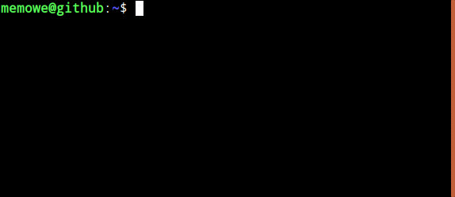

"Matrix" Style Digital Rain
===========================

Just a small curses finger exercise.

## Requirements

- [Perl][perl] 5.20
- Perl module [Class::Tiny][ct] 1.006
- Perl module [Curses][crs] 1.36

[perl]: https://www.perl.org/get.html
[ct]: https://metacpan.org/pod/Class::Tiny
[crs]: https://metacpan.org/pod/Curses

## Installation

Use your standard perl module installation procedures (e. g. [cpanm][cpanm]) or the classic

    $ perl Makefile.PL
    $ make
    $ make install

[cpanm]: https://metacpan.org/pod/App::cpanminus

## Run it

    $ matrix_digital_rain

Kill it with <kbd>Ctrl</kbd>+<kbd>C</kbd>.

## Author and License

(c) 2019 [Mirko Westermeier][mw].

Released under the [MIT License][mit].

[mw]: https://mirko.westermeier.de/
[mit]: LICENSE
